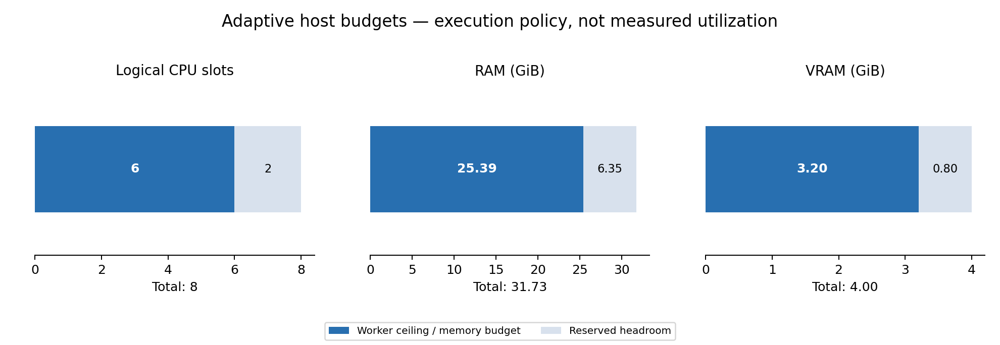
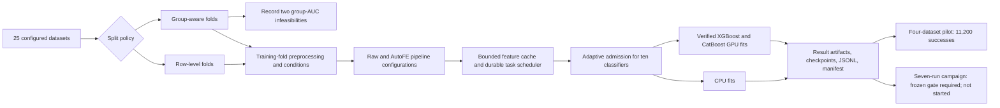

# AutoFE-ShiftBench

AutoFE-ShiftBench compares raw-feature classifiers with automated feature engineering on 25 tabular classification datasets: 24 from OpenML and Dry Bean from the UCI Machine Learning Repository. The repository contains a historical run and a separate corrected-run implementation. The historical scores and paper assets have not been recomputed by the corrected code.

## Current status (2026-10-01)

The final audit fixed a parallel-cache lifecycle error that could exhaust the 8 GiB cap during a long run. Completed feature groups are now reclaimed after durable consumers, cache admission drains active work, prepared arrays/hashes are reused once per group, and completed classifiers publish without waiting for slower earlier submissions. Scientific settings and complete task coverage are preserved. The [final optimization report](provenance/reviewer1_final_optimization_v1.md) records validation and limitations.

The earlier fixed-policy before/after comparison completed 560 cells per policy per version across four small datasets, all 14 pipelines and all ten classifiers. Row runtime fell from 182.7 to 107.8 seconds; group runtime from 200.4 to 133.1 seconds. Exact matrices, predictions, metrics and candidate counts are checked. These clean one-seed/one-fold measurements are historical timing evidence, not an adaptive-policy speed estimate or a full-grid ETA. The final adaptive p12 suite passed **160 tests** (27 warnings). Current-source large-data and fresh restart evidence are recorded in the adaptive verification report.

The corrected campaign has **NOT STARTED**. All seven adaptive launch gates passed in the dated [v4 snapshot](provenance/reviewer1_launch_readiness_v4.json). Re-run the verifier in the [v4 command sheet](provenance/launch_commands_v4.md) immediately before each long run; the earlier v2/v3 green reports are historical after source changes. Use the [v4 frozen scope](provenance/reviewer1_launch_scope_v4.json). The complete design is unchanged: **seven runs, 14 pipelines, ten classifiers; 2,275,000 intended cells, 84,000 planned group-AUC skips, at most 2,191,000 eligible before domain-condition skips**. Group primary all-seed AUC covers at most 23 datasets; wine-quality-red/kddcup99 retain explicit infeasibility records without substitute folds. A separate clean mechanism scope adds 1,250 feature tasks (50 skips).

The [Reviewer #1 checklist](provenance/reviewer1_completion_checklist.md) lists all nine scientific concerns and the engineering follow-up. The implemented paths and bounded verification are complete; all seven current-source launch gates passed. Corrected ROC-AUC contrasts, operator effects, Jacobian associations, statistical conclusions and manuscript/rebuttal numerical revisions remain **PENDING CORRECTED RUN**. The [manuscript phrase checklist](provenance/reviewer1_manuscript_phrase_checklist.md) records required later edits. Longer runtime is acceptable; the older 229.69-day planning scenario is highly uncertain and is not the new source's ETA.

This chart preserves the earlier pilot/profile measurement and reads the current v4 gate with `python provenance/render_readme_pilot_visual.py`. It is code-verification evidence, not corrected scientific performance.

## Adaptive resources on this PC

The [resource policy](provenance/adaptive_resource_design.md) replaces the fixed four-worker / 8 GiB execution settings. Scientific feature caps, candidate rules, all 14 pipelines and ten classifiers stay in the frozen study.

| Resource | Detected | Default allocation / headroom |
|---|---:|---|
| CPU | 8 logical slots, 4 physical cores | Up to 6 model workers; reserve 2 logical slots. Numerical libraries use one thread per fit. |
| RAM | 31.73 GiB | 25.39 GiB soft budget, 6.35 GiB reserve. Live pressure reduces concurrency or pauses admission. |
| RTX 3050 VRAM | 4 GiB | 3.2 GiB admission budget, 0.8 GiB headroom; one fit per GPU at a time. |
| Regenerable disk cache | Host-derived | About 11.92 GiB ready cache plus the same staging allowance. |

RAM is used by useful work; small datasets will not consume 20–25 GiB. XGBoost and CatBoost passed real GPU probes on this host. Other classifiers keep their supported CPU implementation. GPU training is a backend change, and CPU/GPU metrics are not asserted identical; CatBoost GPU training is nondeterministic. Each success records actual backend/device, sampled worker RSS, and a hash-linked resolved model-parameter catalog. See the [official CatBoost GPU documentation](https://catboost.ai/docs/en/features/training-on-gpu).

## Implementation map

The revision code covers these areas:

| Area | Implemented behavior | Main code |
|---|---|---|
| Data and split integrity | Dataset/source hashes, training-only preprocessing, deterministic group IDs, zero duplicate-vector overlap across group folds, and explicit infeasible AUC cells | [`data_loader.py`](src/data_loader.py), [`group_splits.py`](src/group_splits.py), [`pipeline_runner.py`](src/pipeline_runner.py) |
| Condition scope | Ten primary training-corruption conditions are separated from target-free transductive partitions, training-feature availability, and majority-label relabeling sensitivities | [`shift_generator.py`](src/shift_generator.py), [`splitters.py`](src/splitters.py), [condition crosswalk](provenance/reviewer1_condition_crosswalk.md) |
| Feature and mechanism audit | Cap-matched Raw baseline; operator isolation and leave-one-out variants; finite/duplicate candidate rejection and per-operator counts; arithmetic Jacobian and optional candidate histories | [`feature_engineering.py`](src/feature_engineering.py), [`mechanism_audit.py`](src/mechanism_audit.py) |
| Result analysis | Expected-cell coverage, dataset-level paired comparisons, 10,000-replicate paired bootstrap intervals (seed `20260929`), Holm-adjusted test metadata, and streaming corrected paper tables/figures | [`reviewer1_analysis.py`](src/reviewer1_analysis.py), [`generate_corrected_assets.py`](provenance/generate_corrected_assets.py) |
| Recovery and resource control | Regenerable bounded cache, atomic publication, leases and heartbeats, restart reconciliation, one-coordinator fence, and concurrent model workers | [`resource_policy.py`](src/resource_policy.py), [`cache_manager.py`](src/cache_manager.py), [`task_scheduler.py`](src/task_scheduler.py), [`pipeline_runner.py`](src/pipeline_runner.py) |

These are implemented and bounded-verified paths. The [change catalog](provenance/reviewer1_change_catalog.md) records detailed evidence and remaining limits.

### Arithmetic operator configurations

The following are the actual 14 frozen runner pipeline names. `✓` means that the arithmetic operator is enabled; `—` means it is disabled or the pipeline does not synthesize features.

| Pipeline | Add | Subtract | Multiply | Divide |
|---|:---:|:---:|:---:|:---:|
| `Raw` | — | — | — | — |
| `Raw_CapMatched` | — | — | — | — |
| `AutoFE_Baseline` | ✓ | ✓ | ✓ | ✓ |
| `AutoFE_MI` | ✓ | ✓ | ✓ | ✓ |
| `AutoFE_Random` | ✓ | ✓ | ✓ | ✓ |
| `AutoFE_NoMultiply` | ✓ | ✓ | — | — |
| `AutoFE_Isolate_Add` | ✓ | — | — | — |
| `AutoFE_Isolate_Subtract` | — | ✓ | — | — |
| `AutoFE_Isolate_Multiply` | — | — | ✓ | — |
| `AutoFE_Isolate_Divide` | — | — | — | ✓ |
| `AutoFE_LeaveOut_Add` | — | ✓ | ✓ | ✓ |
| `AutoFE_LeaveOut_Subtract` | ✓ | — | ✓ | ✓ |
| `AutoFE_LeaveOut_Multiply` | ✓ | ✓ | — | ✓ |
| `AutoFE_LeaveOut_Divide` | ✓ | ✓ | ✓ | — |

`AutoFE_NoMultiply` keeps its historical identity: it removes **multiplication and division together**. Operator isolation and leave-one-out variants use depth 1, at most 20 base features, at most 100 selected features, and variance selection. They may generate different numbers of eligible candidates; result rows report generated, rejected, eligible, selected, and duplicate counts by operator. See the [operator manifest](provenance/reviewer1_operator_ablation_manifest_v1.json) for the validity and operand-order rules.

## Corrected evaluation protocol

The primary study uses repeated stratified five-fold outer partitions. This is not nested cross-validation: model and pipeline comparisons use the same evaluation folds, so selecting a winner from those results can be optimistic. Labels may be used to stratify ordinary outer folds. They are not passed to preprocessing, feature selection, or model fitting except as training labels.

Imputation, scaling, one-hot vocabulary, feature ranking, DFS feature definitions, and model fitting are learned from training rows. The fitted transformations are applied to held-out features. Held-out labels are only encoded with the training label vocabulary and used for evaluation. Synthetic tests cover these boundaries; they do not establish that every source feature is free from a target proxy.

The primary conditions are clean training data; Gaussian noise at 0.01, 0.05, and 0.10; missing values at 0.05, 0.10, and 0.20; and label noise at 0.05, 0.10, and 0.20. The test partition remains unchanged, so these conditions measure performance under training-data corruption, not deployment-time distribution shift.

PCA covariate partitions and K-means population partitions are target-free but use the full feature matrix, including held-out rows, to define their geometry. They are separate transductive domain-partition experiments and are excluded from primary comparisons. Majority-class relabeling is a label-relabeling experiment, not class-prior resampling. Dropping training features is a feature-availability ablation.

The primary analysis compares Raw with four named AutoFE variants. It pairs results within dataset/task and uses datasets as the independent unit for Wilcoxon contrasts with Holm correction. Folds, seeds, models, and conditions are not treated as independent datasets.

The corrected runner exposes two separate split tracks. `--split-policy row_level`
is the legacy-comparable stratified fold; `--split-policy group_aware` groups
identical target-excluded raw predictor rows and asserts zero shared groups in
each fold. Group-aware class/AUC infeasibility is recorded explicitly and is
never replaced with a row-level fold.

### Runner parameters

The full scientific design is five seeds (`42`, `123`, `456`, `789`, `2025`), five folds, ten primary conditions, ten classifiers, and the 14 pipelines above per split policy. The following `src.pipeline_runner` options control bounded runs and the added recovery paths. Defaults describe the CLI; the approved settings for this host are in the [frozen command sheet](provenance/launch_commands_v4.md).

| Parameter | Current behavior |
|---|---|
| `--run-id`, `--data-dir`, `--output-root` | Run identity (timestamp default), input CSV directory (`data/raw`), and output root (`corrected_runs`). Use a new ID when code or configuration changes. |
| `--max-datasets`, `--max-seeds`, `--max-folds`, `--max-conditions` | Optional limits for bounded work; omitted means the complete configured dimension. |
| `--pipelines`, `--models` | Explicit lists; CLI defaults are `Raw AutoFE_Baseline` and `logistic_regression`. These defaults are smaller than the frozen 14-pipeline, ten-model design. |
| `--split-policy` | `row_level` (default) or `group_aware`; the two tracks need separate run identities. |
| `--scope` | `primary` (default), `transductive_domain_partition`, `feature_availability_ablation`, or `majority_label_relabeling`. Each scope and split policy needs its own run ID. Transductive domain partitions are row-level only. |
| `--cache-policy`, `--cache-max-gib` | `retain` (default) or regenerable `bounded` cache; the optional positive GiB override applies to bounded runs. Adaptive bounded mode derives its default cap from host RAM/disk; the historical pilot used 8 GiB. |
| `--durable-scheduler`, `--scheduler-lease-seconds`, `--scheduler-max-attempts` | Opt-in durable scheduling; lease default 3,600 seconds and maximum attempts default 3. The completed group-aware pilot used a 600-second lease. |
| `--manifest-policy` | `detailed` (default) keeps task rows in `manifest.json` for bounded runs. Grids above 10,000 cells require `compact`, which writes task status to `manifest_outcomes.sqlite`; compact mode requires the durable scheduler and disables the verbose cache audit. |
| `--workers` | Manual-policy concurrent outer model-fit processes; default 1. Adaptive CLI execution instead detects a worker ceiling. The bounded pilot used 4, which is not a host-wide launch recommendation. Parallel compact runs require `OMP_NUM_THREADS`, `MKL_NUM_THREADS`, `OPENBLAS_NUM_THREADS`, and `NUMEXPR_NUM_THREADS` set to `1` before Python starts; these values are part of run identity. |
| `--cache-audit` | Opt-in per-feature build, hit, reader, consumer, and deletion evidence for bounded-cache runs. |
| `--use-gpu` | Explicit CUDA routing in manual mode. Adaptive mode uses `--gpu-policy` and verified host capability. |
| `--resource-policy` | CLI default `adaptive`; `manual` preserves explicit execution settings. The Python API defaults to `manual` for existing scripts. |
| `--reserve-cpus` | Default 2 logical CPU slots; workers share the remaining affinity mask. This PC exposes 8 logical slots / 4 physical cores, so the default ceiling is 6 workers. |
| `--ram-target-fraction`, `--vram-target-fraction` | Default 0.8 each; RAM admission and live GPU headroom adapt to available memory. These are soft estimates, not native allocator limits or minimum utilization targets. |
| `--gpu-policy` | `auto` probes XGBoost/CatBoost on every visible NVIDIA GPU. A shared matrix bound across configured pipelines selects CPU for the whole comparison when it exceeds every VRAM budget; the reason is explicit; temporary pressure waits. `cpu` disables GPU; `require` fails unsupported/oversized GPU work. |
| `--resource-profile` | Frozen scope JSON with the host/capability plan. Full commands bind its hash and reject source/host/settings changes; temporary VRAM pressure cannot silently change the preferred backend. |
| `--adaptive-worker-cap` | Optional lower override; omitted means the detected ceiling. The bounded batch smoke explicitly requests 1. |

The [launch audit](provenance/friend_pc_launch_audit.md) gives the host-specific checks needed before selecting workers, cache capacity, leases, and GPU routing for any long run.

## Existing environment and run commands

Activate the existing Conda environment; these instructions do not create an environment:

~~~
conda activate p12
python -m src.pipeline_runner --run-id corrected-smoke --resource-policy adaptive --adaptive-worker-cap 1 --max-datasets 1 --max-seeds 1 --max-folds 1 --max-conditions 2 --pipelines Raw AutoFE_Baseline --models logistic_regression

# Bounded Reviewer #1 gate (existing p12 environment; no full campaign)
python -m provenance.reviewer1_preflight
python -m provenance.reviewer1_scale_preflight
python provenance/measure_host.py --output provenance/friend_pc_host_manifest.json --probe-root D:\\DR2\\AutoFE_Submission --probe-mib 64
python -m provenance.profile_runner --stage-datasets sonar airlines --mix-dataset sonar --workers 1 2 3 4
# Run the same bounded profile with --use-gpu only after the host probe confirms CUDA/backend support.
~~~

`requirements.txt` pins the runner, plotting, profiling, and test packages used in this repository, including direct `threadpoolctl` and `pytest` imports. All 21 exact version pins and the `setuptools<81` constraint matched the existing `p12` environment at the 2026-10-01 audit. The environment-wide `pip check` still reports conflicts from installed `tableshift`, `opencv-python`, and `tabpfn`; this audit did not modify `p12`. Jupyter is not required for the corrected command-line workflow; the historical notebook needs a separate notebook frontend if it is used.

The smoke grid includes clean data and one Gaussian-noise condition. It writes its ledger, cache manifests, task checkpoints, and run manifest under corrected_runs/corrected-smoke/. Each corrected run must use a new run ID if its code or configuration changes.

On this Windows checkout, `setup_and_run.bat` uses `D:\Conda\p12\python.exe` to download any missing input for a **four-cell bounded smoke** and then runs the same two-pipeline, one-classifier subset. It does not install packages or start the full campaign. `python main.py` without bounds reaches **12,500 row-level cells** with the runner's default two pipelines and one classifier, so the large-grid guard requires explicit `--manifest-policy compact --durable-scheduler`; it is not the frozen 14-pipeline, ten-classifier, two-policy study.

The [versioned seven-run launch scope](provenance/reviewer1_launch_scope_v4.json) records the exact primary and sensitivity task counts, input hashes, command arguments, and storage assumptions. The separate [mechanism-history scope](provenance/mechanism_history_scope_v3.json) adds two clean-condition candidate/Jacobian runs; it does not add cells to the primary performance denominator. The [command sheet](provenance/launch_commands_v4.md) gives every run and its monitoring/resume command. Earlier 120-cell calibrations are historical-source timing evidence; current-source bounded parity and both forced-restart proofs passed; the [readiness report](provenance/reviewer1_launch_readiness_v4.json) records green checks for all seven IDs. Freezing and verification do not launch tasks.

The [adaptive verification report](provenance/adaptive_resource_verification_v1.json) records the current `airlines` proof under the frozen 600-second scheduler lease. Each four-cell policy run uses Raw/AutoFE_Baseline and XGBoost/CatBoost, is deliberately stopped, and resumes with the same ID; committed results and feature-matrix hashes are retained without refitting. Current adaptive diagnostic logs and ledgers stay under `corrected_runs/adaptive_verification/`; earlier fixed-policy 20-cell recovery evidence stays under `corrected_runs/large_recovery/`. This is diagnostic work only. Interrupted preliminary adaptive attempts remain visible under their original identities. Run only one heavy coordinator at a time on this host.

The configured dataset downloader can be run independently in `p12`:

~~~
conda activate p12
python -c "from src.data_loader import download_datasets_from_list; download_datasets_from_list()"
~~~

Failed dataset downloads stop with an error. Missing configured CSVs also stop a run before tasks start; a partial run is not reported as complete. Dataset acquisition does not clear the full-campaign gate. When the [run plan](provenance/reviewer1_run_plan.md) passes, freeze the current code, data hashes, analysis definitions, and both-policy task manifests before selecting run IDs and launch commands. The bounded cache and durable scheduler settings remain required in the [launch audit](provenance/friend_pc_launch_audit.md).

### What is stored where

The runner produces evidence, not paper tables or figures automatically. Paths below are relative to this repository unless `--data-dir` or `--output-root` is changed.

| Output | Location and purpose |
|---|---|
| Downloaded datasets | `data/raw/<dataset>.csv` and `<dataset>_meta.json`; 25 CSVs and 25 sidecars are present locally. |
| One corrected run | `corrected_runs/<run-id>/manifest.json` records configuration, fingerprints, status totals, and cache accounting; `results.jsonl` is the result and attempt mirror. For compact runs, per-cell current status is in `manifest_outcomes.sqlite`. |
| Resolved classifier parameters | `corrected_runs/<run-id>/model_parameters/<hash>.json` holds deduplicated resolved parameters; result rows link the path and fingerprint. Keep these with the ledgers. Live CatBoost allocation fraction is stored per row. |
| Recovery evidence | The same run directory holds `checkpoints.sqlite`, `results_index.sqlite`, and, with durable scheduling, `scheduler.sqlite` plus `scheduler_results/` artifact JSONs. A coordinator lock is placed beside the run directory. |
| Feature cache | `cache_bounded/` holds regenerable, size-governed artifacts when `--cache-policy bounded` is used; completed consumers permit payload cleanup. The default `retain` policy writes persistent `cache/*.pkl` and manifests, which is unsuitable for the full grid under the current storage gate. |
| Candidate history and Jacobians | The separate mechanism workflow writes `candidate_history.jsonl.gz`, `candidate_jacobians.jsonl.gz`, and a task `status.json` under `corrected_runs/<mechanism-run-id>/tasks/<prefix>/<task-key>/`. The full performance runner does not enable histories. The older bounded preflight sample remains under `corrected_runs/reviewer1_preflight/`. |
| Corrected paper assets | After both completed primary runs, `python -m provenance.generate_corrected_assets` writes `corrected_runs/paper_assets/`: dataset AUC/coverage, all-14 pipeline AUC/resource summary, per-operator candidate counts, condition AUC tables, 15 primary CSVs, eight PNG/PDF figure pairs, a machine-checked result record, and a source-hash asset manifest. `--sensitivity-root corrected_runs` adds separate five-run sensitivity tables/figure after those runs complete. `--mechanism-association corrected_runs/analysis/mechanism_association.json` adds Jacobian tables/figure after both mechanism runs. These generated research outputs must be backed up with the run ledgers. |
| README pilot visualization | The versioned [`four_dataset_pilot_status.svg`](provenance/figures/four_dataset_pilot_status.svg) is regenerated from the pilot diagnosis by [`render_readme_pilot_visual.py`](provenance/render_readme_pilot_visual.py). It is an intentional project artifact, not a temporary file. |
| Standalone workflow drawing | `python -m src.create_workflow_diagram` writes `results/AutoFE_ShiftBench_Workflow.png` and `.pdf` by default; it is a method diagram, not a corrected performance figure. |

The historical ledgers and tables under `reports/tables/`, the historical notebook's `reports/figures/` destination, and the PDFs under `paper/figures/` are separate from corrected run outputs. The current corrected runs contain **no full-benchmark publication tables or figures**; the exporter has been verified on synthetic fixtures and on a clearly labeled, 5,600-cell-per-policy four-dataset pilot export under `corrected_runs/reporting_pilot_smoke/`. The notebook expects historical `final_results.csv` and `aggregated_results.csv`; it is not a corrected-run report generator. The [diagnostic file policy](provenance/README.md) identifies permanent research records, regenerable caches, and transient execution auxiliaries.

### Tables and figures after a completed corrected run

Each split policy needs its own run ID and analysis. Replace `RUN_ID` below with one **completed and audited** run ID. These commands write drafts inside that run directory and do not edit historical reports or manuscript figures:

~~~powershell
$run = 'corrected_runs/RUN_ID'
python -m src.check_progress --run-dir $run
python -m src.generate_tables --results "$run/results.jsonl" --output "$run/analysis/q1_tables_corrected.md"
python -m src.stats_analysis --results "$run/results.jsonl" --output "$run/analysis/statistical_results_dataset_level.csv"
python -c "from src.reviewer1_analysis import build_corrected_result_note; build_corrected_result_note('corrected_runs/RUN_ID/results.jsonl', output_path='corrected_runs/RUN_ID/analysis/reviewer1_result_note.json')"
python -m src.plotting_q1 --results "$run/results.jsonl" --out-dir "$run/figures"
~~~

`generate_tables` writes one Markdown file with ten table sections; `stats_analysis` writes one dataset-level contrast CSV; `reviewer1_analysis` writes a coverage and contrast JSON when given an output path. `plotting_q1` writes Figures 2–10 as PNG/PDF pairs to the explicit figure directory. These tools are separate commands. Table 9 uses the corrected `roc_auc` field and Figure 10 includes the individual operator variants with paired dataset means. The table and figure generators remain **draft tooling** until their scope, uncertainty, and memory use are checked on a completed corrected ledger. Corrected ROC-AUC and figure captions remain **PENDING CORRECTED RUN**.

After both primary policies and both mechanism runs finish, `python -m provenance.analyze_mechanism_history` writes `corrected_runs/analysis/mechanism_association.json` using complete clean-condition dataset pairs only. It verifies feature-matrix hashes between the mechanism and performance runs, then reports separate row/group Spearman associations, permutation p-values, dataset bootstrap intervals, and Holm-adjusted p-values. The command and exact paths are in the [command sheet](provenance/launch_commands_v4.md). It cannot produce a corrected scientific conclusion before those runs finish.

The streaming paper-asset command is:

~~~powershell
$py = 'D:\Conda\p12\python.exe'
& $py -m provenance.generate_corrected_assets
# Once the separate mechanism association JSON is complete:
& $py -m provenance.generate_corrected_assets --mechanism-association corrected_runs/analysis/mechanism_association.json
# Once all five sensitivity runs are also complete:
& $py -m provenance.generate_corrected_assets --sensitivity-root corrected_runs --mechanism-association corrected_runs/analysis/mechanism_association.json
~~~

The exporter is the authoritative full-grid primary analysis path. It writes15 primary CSVs, eight PNG/PDF figure pairs, `asset_manifest.json` and a machine-checked `corrected_results_note.md` under `corrected_runs/paper_assets/`. Tables include dataset AUC/coverage/reasons, pipeline AUC/feature/resource summaries, condition AUC, unique-feature-task candidate counts, prespecified dataset ROC-AUC bootstrap/Holm contrasts, descriptive matched-cap/operator contrasts, common-complete-dataset row/group comparisons, and eligible-primary missing-outcome identification bounds. F1 in statistical table names denotes the prespecified family, not the classifier F1 metric. Missing older timing fields remain null; preparation cost is shared across classifiers and must be deduplicated for totals.

Figures show paired AUC differences, candidate rates/stages, coverage, common-set row/group differences, prespecified uncertainty and missingness ranges. Mechanism JSON adds two tables and a scatter PNG/PDF pair. The five sensitivity runs add four tables and a separate figure pair; their estimands are never pooled into primary estimates. Running/partial or mismatched sources are refused. Terminal failures are explicitly labeled with `scientific_complete=false`; the campaign helper stops for inspection. The older `src.stats_analysis`/`src.reviewer1_analysis` are draft tools with memory/coverage limitations and are not the final full-grid command.

## Provenance and historical results

- provenance/original_run.json records the historical local ledger hashes and counts.
- provenance/corrected_smoke_manifest.json is an inspectable synthetic smoke-task example, not a benchmark estimate.
- Each corrected run has a unique ID, source CSV checksum, dataset identity/version when available, target and proxy review, split hashes, stable perturbation seed, code/configuration fingerprints, per-phase status, and cache fingerprint.
- The old reports/tables/results_stream.jsonl, its backup, and the original paper figures are historical evidence. Corrected runs write to corrected_runs/ and do not overwrite them.
- The manuscript methods, captions, and numerical claims remain unchanged until a full corrected run and its analyses are available. The original ledger is present locally; it must not be presented as a corrected result.
- Legacy readers under `src/analysis/`, `src/plotting.py`, and `notebooks/visualization.ipynb` target historical paths or schemas. They are not corrected primary-analysis tools. `src/check_progress.py` reads a specific corrected run directory and never reads the historical cache.
