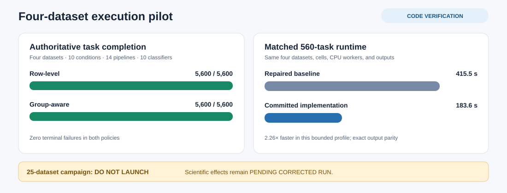
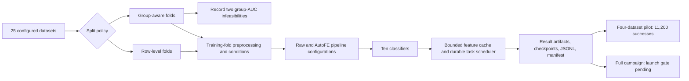

# AutoFE-ShiftBench

AutoFE-ShiftBench compares raw-feature classifiers with automated feature engineering on 25 tabular classification datasets: 24 from OpenML and Dry Bean from the UCI Machine Learning Repository. The repository contains a historical run and a separate corrected-run implementation. The historical scores and paper assets have not been recomputed by the corrected code.

## Current status (2026-10-01)

The bounded four-dataset pilot is complete: both `row_level` and `group_aware` finished **5,600/5,600 authoritative task cells**, with zero terminal failures. It covered one seed and fold, ten conditions, 14 pipelines, and ten classifiers. Retries and interrupted attempts are documented in the [pilot diagnosis](provenance/four_dataset_pilot_diagnosis.md). This pilot verifies execution and recovery; it is not a corrected 25-dataset performance result.

A separate, same-cell 560-task group-aware profile finished with identical matrices, predictions, and metrics before and after the scheduler/cache changes. The committed implementation took 183.6 seconds versus 415.5 seconds for the repaired baseline on those four small datasets. The integrated `p12` suite passed 94 tests. These measurements do not establish large-dataset throughput.

The full campaign remains **DO NOT LAUNCH**. Its versioned scope is 1,750,000 intended cells across both split policies, including 70,000 explicit group-AUC skips, leaving 1,680,000 AUC-eligible cells. A representative large-dataset host measurement must show at least 7,000 valid cells/hour with storage and memory margin; the remaining fault checks and a refreshed code/manifest freeze are also required. Corrected ROC-AUC, operator, Jacobian, and statistical effects are **PENDING CORRECTED RUN**. See the [run plan](provenance/reviewer1_run_plan.md) and [friend-PC launch audit](provenance/friend_pc_launch_audit.md) for the gate and the [change catalog](provenance/reviewer1_change_catalog.md) for the implemented revision.

The chart is generated from the audited [pilot diagnosis](provenance/four_dataset_pilot_diagnosis.md) with `python provenance/render_readme_pilot_visual.py`. Its runtime bars compare execution of the same 560 clean-condition cells; they are not ROC-AUC or full-campaign throughput estimates.

## Implementation map

The revision code covers these areas:

| Area | Implemented behavior | Main code |
|---|---|---|
| Data and split integrity | Dataset/source hashes, training-only preprocessing, deterministic group IDs, zero duplicate-vector overlap across group folds, and explicit infeasible AUC cells | [`data_loader.py`](src/data_loader.py), [`group_splits.py`](src/group_splits.py), [`pipeline_runner.py`](src/pipeline_runner.py) |
| Condition scope | Ten primary training-corruption conditions are separated from target-free transductive partitions, training-feature availability, and majority-label relabeling sensitivities | [`shift_generator.py`](src/shift_generator.py), [`splitters.py`](src/splitters.py), [condition crosswalk](provenance/reviewer1_condition_crosswalk.md) |
| Feature and mechanism audit | Cap-matched Raw baseline; operator isolation and leave-one-out variants; finite/duplicate candidate rejection and per-operator counts; arithmetic Jacobian and optional candidate histories | [`feature_engineering.py`](src/feature_engineering.py), [`mechanism_audit.py`](src/mechanism_audit.py) |
| Result analysis | Expected-cell coverage, dataset-level paired comparisons, 10,000-replicate paired bootstrap intervals (seed `20260929`), and Holm-adjusted test metadata | [`reviewer1_analysis.py`](src/reviewer1_analysis.py) |
| Recovery and resource control | Regenerable bounded cache, atomic publication, leases and heartbeats, restart reconciliation, one-coordinator fence, and concurrent model workers | [`cache_manager.py`](src/cache_manager.py), [`task_scheduler.py`](src/task_scheduler.py), [`pipeline_runner.py`](src/pipeline_runner.py) |

These are implemented and bounded-verified paths. The [change catalog](provenance/reviewer1_change_catalog.md) records detailed evidence and remaining limits.

### Arithmetic operator configurations

The following are the actual 14 frozen runner pipeline names. `✓` means that the arithmetic operator is enabled; `—` means it is disabled or the pipeline does not synthesize features.

| Pipeline | Add | Subtract | Multiply | Divide |
|---|:---:|:---:|:---:|:---:|
| `Raw` | — | — | — | — |
| `Raw_CapMatched` | — | — | — | — |
| `AutoFE_Baseline` | ✓ | ✓ | ✓ | ✓ |
| `AutoFE_MI` | ✓ | ✓ | ✓ | ✓ |
| `AutoFE_Random` | ✓ | ✓ | ✓ | ✓ |
| `AutoFE_NoMultiply` | ✓ | ✓ | — | — |
| `AutoFE_Isolate_Add` | ✓ | — | — | — |
| `AutoFE_Isolate_Subtract` | — | ✓ | — | — |
| `AutoFE_Isolate_Multiply` | — | — | ✓ | — |
| `AutoFE_Isolate_Divide` | — | — | — | ✓ |
| `AutoFE_LeaveOut_Add` | — | ✓ | ✓ | ✓ |
| `AutoFE_LeaveOut_Subtract` | ✓ | — | ✓ | ✓ |
| `AutoFE_LeaveOut_Multiply` | ✓ | ✓ | — | ✓ |
| `AutoFE_LeaveOut_Divide` | ✓ | ✓ | ✓ | — |

`AutoFE_NoMultiply` keeps its historical identity: it removes **multiplication and division together**. Operator isolation and leave-one-out variants use depth 1, at most 20 base features, at most 100 selected features, and variance selection. They may generate different numbers of eligible candidates; result rows report generated, rejected, eligible, selected, and duplicate counts by operator. See the [operator manifest](provenance/reviewer1_operator_ablation_manifest_v1.json) for the validity and operand-order rules.

## Corrected evaluation protocol

The primary study uses repeated stratified five-fold outer partitions. This is not nested cross-validation: model and pipeline comparisons use the same evaluation folds, so selecting a winner from those results can be optimistic. Labels may be used to stratify ordinary outer folds. They are not passed to preprocessing, feature selection, or model fitting except as training labels.

Imputation, scaling, one-hot vocabulary, feature ranking, DFS feature definitions, and model fitting are learned from training rows. The fitted transformations are applied to held-out features. Held-out labels are only encoded with the training label vocabulary and used for evaluation. Synthetic tests cover these boundaries; they do not establish that every source feature is free from a target proxy.

The primary conditions are clean training data; Gaussian noise at 0.01, 0.05, and 0.10; missing values at 0.05, 0.10, and 0.20; and label noise at 0.05, 0.10, and 0.20. The test partition remains unchanged, so these conditions measure performance under training-data corruption, not deployment-time distribution shift.

PCA covariate partitions and K-means population partitions are target-free but use the full feature matrix, including held-out rows, to define their geometry. They are separate transductive domain-partition experiments and are excluded from primary comparisons. Majority-class relabeling is a label-relabeling experiment, not class-prior resampling. Dropping training features is a feature-availability ablation.

The primary analysis compares Raw with four named AutoFE variants. It pairs results within dataset/task and uses datasets as the independent unit for Wilcoxon contrasts with Holm correction. Folds, seeds, models, and conditions are not treated as independent datasets.

The corrected runner exposes two separate split tracks. `--split-policy row_level`
is the legacy-comparable stratified fold; `--split-policy group_aware` groups
identical target-excluded raw predictor rows and asserts zero shared groups in
each fold. Group-aware class/AUC infeasibility is recorded explicitly and is
never replaced with a row-level fold.

### Runner parameters

The full scientific design is five seeds (`42`, `123`, `456`, `789`, `2025`), five folds, ten primary conditions, ten classifiers, and the 14 pipelines above per split policy. The following `src.pipeline_runner` options control bounded runs and the added recovery paths. Defaults describe the CLI, not an approved full-run configuration.

| Parameter | Current behavior |
|---|---|
| `--run-id`, `--data-dir`, `--output-root` | Run identity (timestamp default), input CSV directory (`data/raw`), and output root (`corrected_runs`). Use a new ID when code or configuration changes. |
| `--max-datasets`, `--max-seeds`, `--max-folds`, `--max-conditions` | Optional limits for bounded work; omitted means the complete configured dimension. |
| `--pipelines`, `--models` | Explicit lists; CLI defaults are `Raw AutoFE_Baseline` and `logistic_regression`. These defaults are smaller than the frozen 14-pipeline, ten-model design. |
| `--split-policy` | `row_level` (default) or `group_aware`; the two tracks need separate run identities. |
| `--scope` | `primary` (default), `transductive_domain_partition`, `feature_availability_ablation`, or `majority_label_relabeling`. Each scope and split policy needs its own run ID. Transductive domain partitions are row-level only. |
| `--cache-policy`, `--cache-max-gib` | `retain` (default) or regenerable `bounded` cache; the optional positive GiB cap applies to bounded runs. The pilot used `bounded` with 8 GiB. |
| `--durable-scheduler`, `--scheduler-lease-seconds`, `--scheduler-max-attempts` | Opt-in durable scheduling; lease default 3,600 seconds and maximum attempts default 3. The completed group-aware pilot used a 600-second lease. |
| `--manifest-policy` | `detailed` (default) keeps task rows in `manifest.json` for bounded runs. Grids above 10,000 cells require `compact`, which writes task status to `manifest_outcomes.sqlite`; compact mode requires the durable scheduler and disables the verbose cache audit. |
| `--workers` | Concurrent outer model-fit processes; default 1. The bounded pilot used 4, which is not a host-wide launch recommendation. Parallel compact runs require `OMP_NUM_THREADS`, `MKL_NUM_THREADS`, `OPENBLAS_NUM_THREADS`, and `NUMEXPR_NUM_THREADS` set to `1` before Python starts; these values are part of run identity. |
| `--cache-audit` | Opt-in per-feature build, hit, reader, consumer, and deletion evidence for bounded-cache runs. |
| `--use-gpu` | Opt-in CUDA routing for XGBoost/CatBoost when the host and backend support it; the completed pilot used CPU. |

The [launch audit](provenance/friend_pc_launch_audit.md) gives the host-specific checks needed before selecting workers, cache capacity, leases, and GPU routing for any long run.

## Existing environment and run commands

Activate the existing Conda environment; these instructions do not create an environment:

~~~
conda activate p12
python -m src.pipeline_runner --run-id corrected-smoke --workers 1 --max-datasets 1 --max-seeds 1 --max-folds 1 --max-conditions 2 --pipelines Raw AutoFE_Baseline --models logistic_regression

# Bounded Reviewer #1 gate (existing p12 environment; no full campaign)
python -m provenance.reviewer1_preflight
python -m provenance.reviewer1_scale_preflight
python provenance/measure_host.py --output provenance/friend_pc_host_manifest.json --probe-root D:\\DR2\\AutoFE_Submission --probe-mib 64
python -m provenance.profile_runner --stage-datasets sonar airlines --mix-dataset sonar --workers 1 2 3 4
# Run the same bounded profile with --use-gpu only after the host probe confirms CUDA/backend support.
~~~

`requirements.txt` pins the runner, plotting, profiling, and test packages used in this repository, including direct `threadpoolctl` and `pytest` imports. All 22 listed pins matched the existing `p12` environment at the 2026-10-01 audit. The environment-wide `pip check` still reports conflicts from installed `tableshift`, `opencv-python`, and `tabpfn`; this audit did not modify `p12`. Jupyter is not required for the corrected command-line workflow; the historical notebook needs a separate notebook frontend if it is used.

The smoke grid includes clean data and one Gaussian-noise condition. It writes its ledger, cache manifests, task checkpoints, and run manifest under corrected_runs/corrected-smoke/. Each corrected run must use a new run ID if its code or configuration changes.

On this Windows checkout, `setup_and_run.bat` uses `D:\Conda\p12\python.exe` to download any missing input for a **four-cell bounded smoke** and then runs the same two-pipeline, one-classifier subset. It does not install packages or start the full campaign. `python main.py` without bounds reaches **12,500 row-level cells** with the runner's default two pipelines and one classifier, so the large-grid guard requires explicit `--manifest-policy compact --durable-scheduler`; it is not the frozen 14-pipeline, ten-classifier, two-policy study.

The [versioned seven-run launch scope](provenance/reviewer1_launch_scope_v2.json) records the exact primary and sensitivity task counts, input hashes, command arguments, storage assumptions, and unresolved host gate. The [command sheet](provenance/launch_commands_v2.md) gives every separate run and its monitoring/resume command. Regenerate the scope with `D:\Conda\p12\python.exe -m provenance.freeze_reviewer1_launch_v2` after the all-seed group audit. The ten-day target has been waived; a representative large-dataset runtime estimate and recovery check are still needed on the intended execution host. Freezing writes a plan and does not launch tasks.

The configured dataset downloader can be run independently in `p12`:

~~~
conda activate p12
python -c "from src.data_loader import download_datasets_from_list; download_datasets_from_list()"
~~~

Failed dataset downloads stop with an error. Missing configured CSVs also stop a run before tasks start; a partial run is not reported as complete. Dataset acquisition does not clear the full-campaign gate. When the [run plan](provenance/reviewer1_run_plan.md) passes, freeze the current code, data hashes, analysis definitions, and both-policy task manifests before selecting run IDs and launch commands. The bounded cache and durable scheduler settings remain required in the [launch audit](provenance/friend_pc_launch_audit.md).

### What is stored where

The runner produces evidence, not paper tables or figures automatically. Paths below are relative to this repository unless `--data-dir` or `--output-root` is changed.

| Output | Location and purpose |
|---|---|
| Downloaded datasets | `data/raw/<dataset>.csv` and `<dataset>_meta.json`; 25 CSVs and 25 sidecars are present locally. |
| One corrected run | `corrected_runs/<run-id>/manifest.json` records configuration, fingerprints, status totals, and cache accounting; `results.jsonl` is the result and attempt mirror. For compact runs, per-cell current status is in `manifest_outcomes.sqlite`. |
| Recovery evidence | The same run directory holds `checkpoints.sqlite`, `results_index.sqlite`, and, with durable scheduling, `scheduler.sqlite` plus `scheduler_results/` artifact JSONs. A coordinator lock is placed beside the run directory. |
| Feature cache | `cache_bounded/` holds regenerable, size-governed artifacts when `--cache-policy bounded` is used; completed consumers permit payload cleanup. The default `retain` policy writes persistent `cache/*.pkl` and manifests, which is unsuitable for the full grid under the current storage gate. |
| Candidate history | Optional detailed histories are produced only when explicitly enabled by the mechanism-audit API; the full runner does not enable them by default. The bounded preflight writes its sample under `corrected_runs/reviewer1_preflight/`. |
| README pilot visualization | The versioned [`four_dataset_pilot_status.svg`](provenance/figures/four_dataset_pilot_status.svg) is regenerated from the pilot diagnosis by [`render_readme_pilot_visual.py`](provenance/render_readme_pilot_visual.py). It is an intentional project artifact, not a temporary file. |
| Standalone workflow drawing | `python -m src.create_workflow_diagram` writes `results/AutoFE_ShiftBench_Workflow.png` and `.pdf` by default; it is a method diagram, not a corrected performance figure. |

The historical ledgers and tables under `reports/tables/`, the historical notebook's `reports/figures/` destination, and the PDFs under `paper/figures/` are separate from corrected run outputs. The current corrected runs contain **no corrected publication tables or figures**. The notebook expects historical `final_results.csv` and `aggregated_results.csv`; it is not a corrected-run report generator. The [diagnostic file policy](provenance/README.md) identifies permanent research records, regenerable caches, and transient execution auxiliaries.

### Tables and figures after a completed corrected run

Each split policy needs its own run ID and analysis. Replace `RUN_ID` below with one **completed and audited** run ID. These commands write drafts inside that run directory and do not edit historical reports or manuscript figures:

~~~powershell
$run = 'corrected_runs/RUN_ID'
python -m src.check_progress --run-dir $run
python -m src.generate_tables --results "$run/results.jsonl" --output "$run/analysis/q1_tables_corrected.md"
python -m src.stats_analysis --results "$run/results.jsonl" --output "$run/analysis/statistical_results_dataset_level.csv"
python -c "from src.reviewer1_analysis import build_corrected_result_note; build_corrected_result_note('corrected_runs/RUN_ID/results.jsonl', output_path='corrected_runs/RUN_ID/analysis/reviewer1_result_note.json')"
python -m src.plotting_q1 --results "$run/results.jsonl" --out-dir "$run/figures"
~~~

`generate_tables` writes one Markdown file with ten table sections; `stats_analysis` writes one dataset-level contrast CSV; `reviewer1_analysis` writes a coverage and contrast JSON when given an output path. `plotting_q1` writes Figures 2–10 as PNG/PDF pairs to the explicit figure directory. These tools are separate commands. Table 9 uses the corrected `roc_auc` field and Figure 10 includes the individual operator variants with paired dataset means. The table and figure generators remain **draft tooling** until their scope, uncertainty, and memory use are checked on a completed corrected ledger. Corrected ROC-AUC and figure captions remain **PENDING CORRECTED RUN**.

## Provenance and historical results

- provenance/original_run.json records the historical local ledger hashes and counts.
- provenance/corrected_smoke_manifest.json is an inspectable synthetic smoke-task example, not a benchmark estimate.
- Each corrected run has a unique ID, source CSV checksum, dataset identity/version when available, target and proxy review, split hashes, stable perturbation seed, code/configuration fingerprints, per-phase status, and cache fingerprint.
- The old reports/tables/results_stream.jsonl, its backup, and the original paper figures are historical evidence. Corrected runs write to corrected_runs/ and do not overwrite them.
- The manuscript methods, captions, and numerical claims remain unchanged until a full corrected run and its analyses are available. The original ledger is present locally; it must not be presented as a corrected result.
- Legacy readers under `src/analysis/`, `src/plotting.py`, and `notebooks/visualization.ipynb` target historical paths or schemas. They are not corrected primary-analysis tools. `src/check_progress.py` reads a specific corrected run directory and never reads the historical cache.
