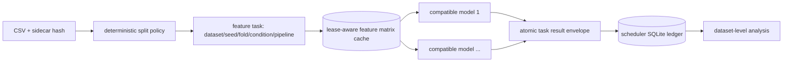

# Reviewer #1 optimization and recovery plan v1

Status: **frozen for gate review; do not launch the corrected campaign** (2026-09-30).  The plan uses the existing Conda `p12` environment at `D:\Conda\p12` and preserves the original scientific scope.

## Frozen identity and coverage

The parent scope is [`reviewer1_scope_manifest.json`](reviewer1_scope_manifest.json), SHA-256 `4ac3d332c0aff8c659fd09b90d2fdfb437b455e9dd7fa16105607294d53d0c32`, with data and fold hashes carried forward unchanged.  The optimization implementation is committed in `906e4cdf4dbbcd513751cd384bfb4e7dee9ad3d1` and `ef98cc8ac67f795bf1b477026edd6f5995c16c4b`; the latter adds task-key-specific scheduler claims.

The row-level track retains all 25 configured datasets.  The group-aware track keeps all 25 in the intended denominator and records the two AUC-infeasible datasets explicitly:

- `wine-quality-red`: at least one test fold lacks a target class.
- `kddcup99`: class support is below five splits and at least one test fold lacks a target class.

No row-level fold is substituted.  Therefore all-fold ROC-AUC coverage is 25/25 for row-level and 23/25 for group-aware, with the two skipped datasets remaining visible in every denominator table.

The exact frozen task counts are 125,000 core cells per policy and 750,000 added-ablation cells per policy.  Each policy contains 875,000 intended cells; group-aware has 805,000 AUC-eligible and 70,000 explicit skips.  Both policies contain 1,750,000 intended cells and 1,680,000 AUC-eligible cells.

## Dependency and cache graph

Feature matrices are reused only by model consumers with the same dataset, seed, fold, condition, split policy, pipeline, code/runtime identity, and cache fingerprint.  They are never shared across a changed split, condition, pipeline, or source hash.  A ready marker, payload checksum, manifest checksum, per-artifact lock, and consumer lease protect reads and cleanup.  The bounded policy deletes an unleased artifact after the last compatible model reaches a terminal state and reconciles stale temporary files before final publication.  The manager records current and high-water bytes and can perform byte-budget LRU cleanup.

## Storage gate

The local probe recorded 435.51 GiB free on `D:`.  The frozen compressed candidate-history estimate is 79.66 GiB and the results/manifests/checkpoint allowance is 20.87 GiB, leaving about 334.98 GiB before ordinary operating-system headroom.  The workspace also has 39 ignored generated preflight files totaling about 1.75 GB; they are not corrected results and must be accounted for by the launch cleanup checklist.  The old retain-all cache projection was 47,377.68 GiB for both policies and all 14 pipelines, so that policy remains rejected.  The optimized launch policy is bounded regenerable cache with an 8 GiB high-water budget; the measured cache is deleted after its final compatible consumer.  This removes retained-cache accumulation but is not a claim that the friend's machine has this capacity.  `provenance/measure_host.py` must be rerun on that machine and the representative large preflight must record free space before launch.

## Runtime and parallelism gate

The large `airlines` scale preflight measured 57.45 seconds for three row-level tasks and 101.89 seconds for three group-aware tasks.  The bounded 80-task Sonar mix measured 91.1865, 46.4736, and 30.6148 seconds at 1, 2, and 4 workers, respectively; all 240 tasks succeeded and all 80 prediction hashes matched between one and four workers.  BLAS/OpenMP pools were fixed to one thread per worker.  The measured local host has eight logical CPUs and an RTX 3050; the GPU was inventoried but not used.

For planning only, applying the observed 2.979x 1-to-4-worker speedup to the original linear projections gives: core row 9.30 days, core group 16.49 days, all-14 row 65.10 days, all-14 group 115.46 days, both policies 180.56 days, and one-model all-14 both policies 18.06 days.  These values exclude any unmeasured cache-reuse benefit and are not corrected benchmark results or a 14-day claim.  The complete grid remains blocked until representative large-task measurements and a new-process resume test are recorded on the intended host.

## Crash-safe lifecycle

`src/task_scheduler.py` provides immutable task registration, WAL/FULL SQLite state, worker leases, heartbeats, expiry, retry classification, and atomic result envelopes.  The runner can enable it with `durable_scheduler=True` or `--durable-scheduler`; it publishes a scheduler result only after task computation, uses task-key-specific claims, and reconciles artifacts on startup.  A task may retry transient worker/I/O failures up to three attempts; deterministic input/programming failures are terminal.  The process-boundary fault-injection suite verifies recovery after a crash before rename and after rename before the SQLite commit.

The bounded runner tests exercise cache cleanup and the durable scheduler, compare retained versus bounded prediction/matrix hashes, and interrupt then resume the runner in a new process.  The 61-test p12 suite, compile check, and diff check passed after integration.  No full benchmark or corrected result ledger has been created.

## Launch checklist

Before any long run:

1. Run the host probe on the intended friend PC and record CPU, RAM, GPU, disk, package versions, and thread settings.
2. Repeat a representative `airlines` row/group preflight with bounded cache and durable scheduler, including interruption in one process and resume in a new process.
3. Confirm free space exceeds candidate history plus ancillary artifacts with a documented margin and that the 8 GiB cache budget stays below the high-water alert.
4. Freeze this manifest, all source/data/analysis hashes, worker/thread settings, run ID, and final code commit with a clean worktree except the pre-existing notebook execution-count change.
5. Keep corrected performance, Jacobian associations, operator effects, and statistical conclusions marked **PENDING CORRECTED RUN** until the ledger is complete and reconciled.

